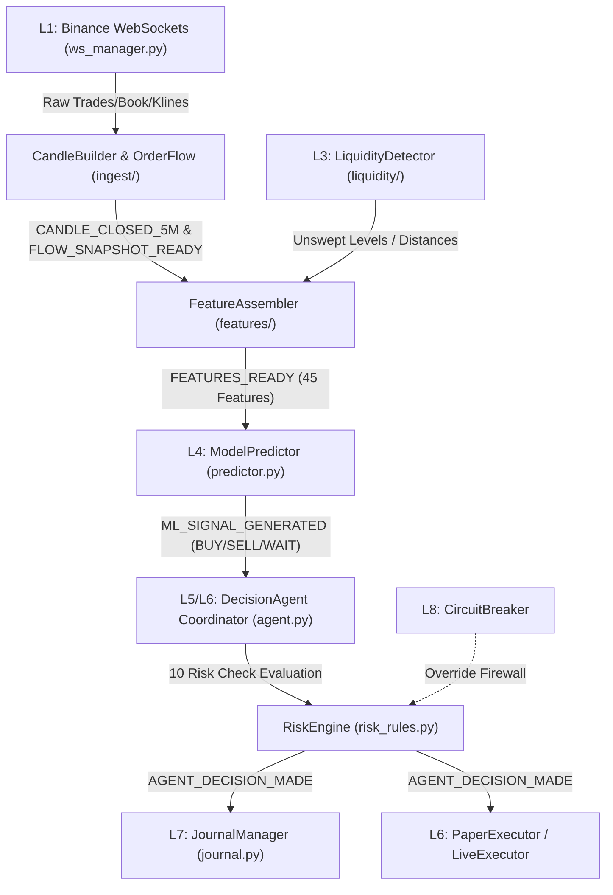

# 🚀 LIQ-MTF: Autonomous Liquidity & Multi-Timeframe Algorithmic Trading System

LIQ-MTF is an enterprise-grade, fully integrated autonomous trading system designed for **BTCUSDT Futures** trading. It implements a 8-layer decoupled pipeline combining real-time WebSocket market data ingestion, dynamic multi-timeframe indicator engineering, structural liquidity map detection, LightGBM machine learning predictions, a learning-based 10-check risk engine, and order routing via Paper and Live executors.

---

## 📐 1. Pipeline Architecture Diagram

The system coordinates events asynchronously across all 8 layers using a central, memory-safe Event Bus:



---

## 📂 2. Repository File Structure

```
src/
├── main.py                     # ◄ System Entrypoint & Pipeline wiring
├── predictor.py                # ◄ L4 Model Predictor & PredictorRunner
├── trainer.py                  # ◄ L4 LightGBM Model Trainer
├── agent.py                    # ◄ L5/L6 Decision Agent & Exec coordinator
├── risk_rules.py               # ◄ L5 10-Check Risk Engine
├── portfolio.py                # ◄ L5 Portfolio Tracker
├── paper_executor.py           # ◄ L6 Paper/Simulated Executor
├── live_executor.py            # ◄ L6 Live Binance REST Executor
├── circuit_breaker.py          # ◄ L8 Safety Firewall & Halts
├── journal.py                  # ◄ L7 SQLite Decision Journal
├── scenario.py                 # ◄ L5 Scenario Snapshot Builder
│
├── core/                       # ◄ Central Framework
│   ├── event_bus.py            # Asynchronous Event Broker
│   ├── config.py               # Settings & Environment Loader
│   ├── logger.py               # JSONL Observability Logging
│   ├── alerter.py              # Telegram Alerts
│   └── heartbeat.py            # L8 Component Ping Daemon
│
├── ingest/                     # ◄ L1 WebSocket Ingestion
│   ├── ws_manager.py           # Connection Multiplexer & Latency Ping
│   ├── candle_builder.py       # Live Kline Aggregator
│   ├── book_tracker.py         # Spread & Order Book Tracker
│   └── order_flow.py           # Net delta & CVD Imbalances
│
├── liquidity/                  # ◄ L3 Structural Liquidity Map
│   └── liquidity_detector.py   # Pivots, clustering, sweeps, dynamic ATR
│
├── features/                   # ◄ L2 Multi-Timeframe Feature Assembler
│   ├── feature_assembler.py    # 45-feature Orchestrator
│   └── indicator_engine.py     # Deques, ATR, RSI, EMA, MACD, BB
│
└── shared/
    └── feature_registry.py     # Single source of truth for 45 features
```

---

## 🛠️ 3. Layer-by-Layer Components

### 🛰️ L1: Ingestion & WSManager
*   **Multiplexed Connection**: Combines `aggTrade`, `bookTicker`, `kline_5m`, and multiplexes `kline_1h/4h` into a single stream, minimizing Binance connection counts to exactly 4.
*   **Latency Monitoring**: Publishes `WS_HEARTBEAT` containing computed round-trip network latency on every ping.
*   **Heartbeat Pings**: Sends periodic system pings (`ws1` to `ws4`) to the heartbeat monitor to prevent connection drops.

### 📊 L2: Feature Assembler & Indicator Engine
*   **45-Feature Matrix**: Compiles all indicator, order flow, liquidity, and derived time components in the exact ordering required by the predictor.
*   **Indicator Engine**: Uses size-300 sliding deques to calculate dynamic multi-timeframe indicators (`5m`, `1h`, `4h`) including ATR, RSI, EMA crosses, MACD histograms, and Bollinger Bands.
*   **Volatility & Calendar**: Computes deterministic sine/cosine waves for hour/day calendar markers and encodes volatility regimes based on the ATR ratio.

### 🧲 L3: Liquidity Map Engine
*   **Pivot Detection**: Identifies pivot highs and lows using a 5-bar lag verification window (lag = 25 minutes on 5m candles).
*   **Dynamic Clustering**: Clusters levels within `0.08 × ATR` into a confluence zone and filters new levels with a `0.70 × ATR` buffer.
*   **Sweep Detection**: Triggers `LEVEL_SWEPT` events if candle highs or lows pierce active levels.

### 🧠 L4: LightGBM Model Trainer & Predictor
*   **Triple Barrier Labeling**: Labels training datasets based on a 60-minute lookahead: BUY (1) if +1.0% is hit first, SELL (2) if -1.0% is hit first, WAIT (0) if timeout expires.
*   **Time-Purged Splits**: Splits data chronologically: Training up to June 2025, Validation July-Dec 2025, using a 60-minute purge gap to eliminate lookahead leakage.
*   **Balanced Class Weights**: Fixes minority recall imbalance using inverse frequency weighting: `wait=1.0`, `buy=19.0`, `sell=17.0`.

### ⚡ L5/L6: Decision Agent & Execution Coordinator
*   **Unified Master Coordinator**: Creates `DecisionAgent` to orchestrate events, log logs to journal, and direct execution outcomes directly without decoupled bus overhead.
*   **10-Check Sequential Rules**:
    1.  *Scenario Win Rate (Learning)*: Checks pattern matching success rate.
    2.  *Trend Alignment (Learning)*: Queries journal database for counter-trend win rates.
    3.  *Liquidity Proximity (Learning)*: Overrides trade if support/resistance is within 0.1%.
    4.  *Order Flow Confirmation (Learning)*: Modifies size based on delta.
    5.  *Spread Safety (Static)*: Blocks trade if spread > 5 bps.
    6.  *Volatility (Static)*: Halves size and tightens SL if ATR spikes.
    7.  *Loss Streak (Static)*: Halves size at 3 losses, blocks trade at 4 losses.
    8.  *Drawdown (Static)*: Blocks trade if session drawdown >= 5.0%.
    9.  *Open Position Limit (Static)*: Restricts active trades to 2.
    10. *Time Filter (Static)*: Reduces size during low liquidity hours (22:00 to 02:00 UTC).
*   **Binance Futures Formatting**: Converts USD trade size to BTC contract size (`usd_size / entry_price`) rounded to 3 decimals, protecting against exchange API rejections.

---

## 🚀 4. Execution & Commands

All commands must be executed from the repository root directory:

### Run the System in Paper Mode
```powershell
# Set Python path and run main entrypoint
$env:PYTHONPATH="."
python src/main.py
```

### Run the Comprehensive Test Suite
Executes all 39 unit tests for L1-L8 components:
```powershell
python -m pytest
```

### Train the ML Model
Trains the LightGBM model on the historical parquet datasets:
```powershell
python -m src.trainer --tp 0.01 --sl 0.01 --lookahead 60
```

### Run Risk Engine Pipeline Simulation
```powershell
python tests/test_agent_risk_pipeline.py
```

---

## 📊 5. Event Specifications

*   `SCENARIO_CREATED`: Fired when a frozen snapshot is generated.
*   `AGENT_DECISION_MADE`: Fired when position sizing and overrides are finalized.
*   `TRADE_CLOSED`: Fired on live or simulated trade completions.
*   `FLOW_SNAPSHOT_READY`: Fired on order flow updates.
